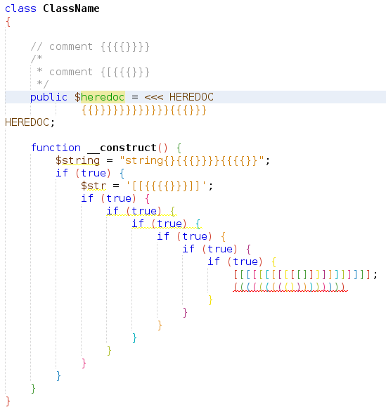
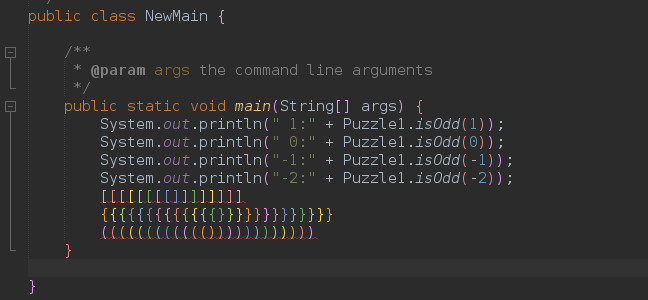
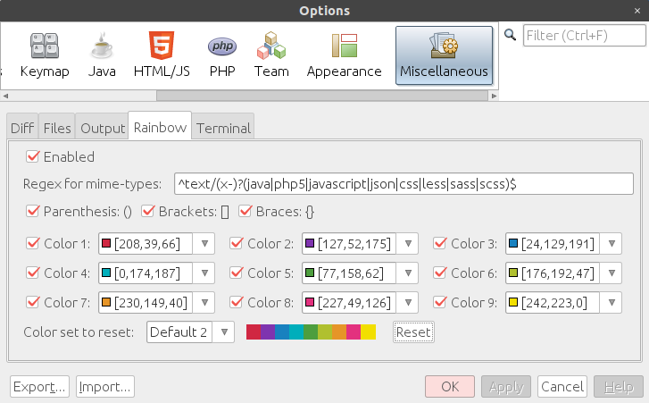

## NetBeans Rainbow Braces Plugin

Rainbow Parentheses/Brackets/Braces for NetBeans





### Options

Tools > Options > Miscellaneous > Rainbow

If you would like to use this plugin for specific mime-types, please modify `Regex for mime-types`.

Colors are customizable.

#### Skip options

If you would like to show colorized braces in comments and strings, please uncheck the below options.

- Skip comments (Checked by default)
- Skip strings (Checked by default)

#### Max number of lines

Braces are not colorized if lines of a file greater than this number.


#### Check only parentheses/brackets/braces of a visible area (Unchecked by default)

Don't check all braces from the top/end of the file. So, colors may be changed when you scroll the editor. But performance is better.



### Downloads

- https://github.com/junichi11/netbeans-rainbow-braces/releases

## Donation

- https://github.com/sponsors/junichi11

### License

```
Apache License, Version 2.0

Copyright 2018 junichi11.

Licensed under the Apache License, Version 2.0 (the "License");
you may not use this file except in compliance with the License.
You may obtain a copy of the License at

     http://www.apache.org/licenses/LICENSE-2.0

Unless required by applicable law or agreed to in writing, software
distributed under the License is distributed on an "AS IS" BASIS,
WITHOUT WARRANTIES OR CONDITIONS OF ANY KIND, either express or implied.
See the License for the specific language governing permissions and
limitations under the License.
```
